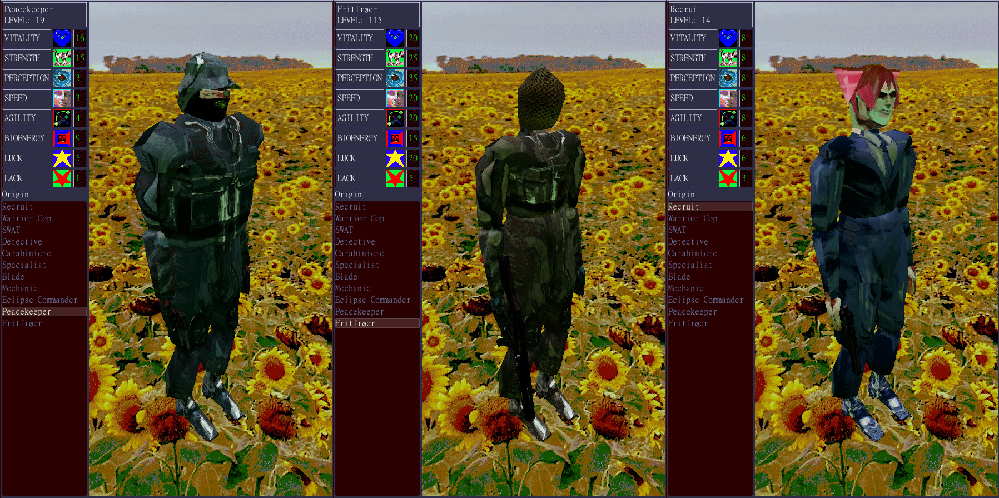

This mod allows you to load custom origins for the player.

# Features
- Create an origin with custom stats, body parts, equipment, weapons, and mech loadout
- Replace existing origins with modified ones
- Customize your character using existing or new textures and meshes, as well as custom scaling

# Installation
1. Install [ppr-modloader](https://github.com/CruS-Modding-Infrastructure/ppr-modloader), then move the zipped mod from Releases into your `mods` directory.
2. Move other zipped mods or the example mods into your `mods` directory as well.

# Contents
- PlayerOriginLoader contains the framework mod required to load custom origins.
- PlayerOriginLoader-Examples contains several examples of new custom origins, including a custom head
- PlayerOriginLoader_ReplaceExample contains an example that replaces Recruit, including a custom hair with a custom mesh

# FAQ
### Q: How do I make an origin?
A: Look at the existing example mods and the ppr-modloader instructions to see how to create a mod.
### Q: My origin is not appearing
A: Check logs/modloader.log in your user folder for any errors. I suggest setting up a Godot development environment so you can inspect the game while you test.
### Q: My body parts aren't loading correctly
A: Please send me your logs/modloader.log file through the #ppr-modding channel in the PPR Discord

# Known Bugs
- "Return to Title Screen" is not supported, as it has equipment persistence bugs in the vanilla game. Exit the game and re-launch to fix equipment persistence

Please report any bugs with your logs/modloader.log file in the Discord.

# To-Do
- Un-hardcode scale values
- Allow for scaling helmet when custom_head is set