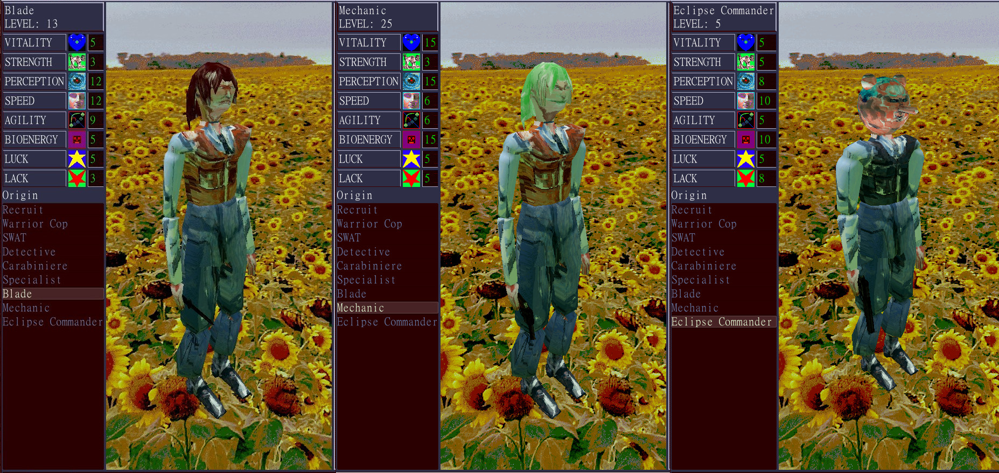

This mod allows you to load custom origins for the player.

# Features
- Create an origin with custom stats, equipment, and mech loadout
- Customize your character using existing or new textures and meshes

# Installation
1. Install [ppr-modloader](https://github.com/CruS-Modding-Infrastructure/ppr-modloader), then move the zipped mod from Releases into your `mods` directory.
2. Create a PlayerOriginLoader folder in your user folder and place the origin .json files you want into that folder
(On Windows, your user folder is located at %AppData%\Roaming\Godot\app_userdata\Psycho Patrol R)

Some example origins have been placed in the "PlayerOriginLoader" folder of this repo.

# FAQ
### Q: How do I make an origin?
A: Copy an existing origin json from the provided files into the PlayerOriginLoader folder and modify the desired entries
### Q: Why not release origins as individual mods?
A: Character customization is very hard-coded in PPR, and this mod performs significant redesign to the system. Distributing each origin as a mod would be ~300 lines of likely conflicting code. My goal for this mod is for it to act as a framework for other users/modders to make custom origins as simply as possible.
### Q: My origin is not appearing
A: Check logs/modloader.log in your user folder for any errors.
### Q: My body parts aren't loading correctly/my female heads are loading as male heads
A: Please send me your logs/modloader.log file through the #ppr-modding channel in the PPR Discord

# Known Bugs
- Head meshes may not be swapping correctly. Please report any instances with your logs/modloader.log file in the Discord.

# To-Do
- Allow for replacing/customizing default origins
- Make more options for aligning/scaling armor and equipment on different bodies, heads
- Hide head when head_mesh is defined (currently default head is not hidden)
